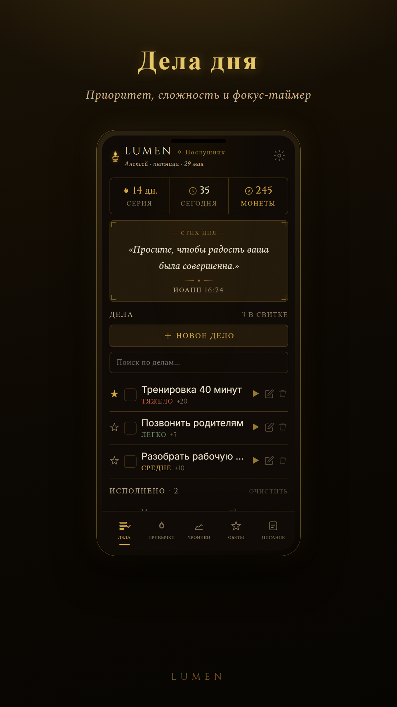

  

  <h1>Lumen</h1>

  
<strong>tasks, habits, scripture and focus in one quiet tracker</strong>

  
Дисциплина без шума: дела, привычки, молитва, фокус и ежедневный ритм.

  

    
    
  

  

    <a href="#english-version">English version</a>
  

  

## Download

| Platform | Build |
| --- | --- |
| Windows | [Setup .exe](https://github.com/vincere-mori/lumen/releases/download/v1.1.1/Lumen_1.1.1_x64-setup.exe) / [MSI](https://github.com/vincere-mori/lumen/releases/download/v1.1.1/Lumen_1.1.1_x64_en-US.msi) |
| macOS | [DMG](https://github.com/vincere-mori/lumen/releases/download/v1.1.1/Lumen_1.1.1_universal.dmg) |
| Linux | [AppImage](https://github.com/vincere-mori/lumen/releases/download/v1.1.1/Lumen_1.1.1_amd64.AppImage) / [DEB](https://github.com/vincere-mori/lumen/releases/download/v1.1.1/Lumen_1.1.1_amd64.deb) / [RPM](https://github.com/vincere-mori/lumen/releases/download/v1.1.1/Lumen-1.1.1-1.x86_64.rpm) |
| Android | [APK](https://github.com/vincere-mori/lumen/releases/download/v1.1.1/LUMEN-v1.1.1-android.apk) |

Web version: [vincere-mori.github.io/lumen](https://vincere-mori.github.io/lumen/)

## Для чего

Lumen помогает держать день в порядке без аккаунтов, рекламы и синхронизации. Все данные остаются на устройстве.

Его удобно открыть утром, выбрать дела, отметить привычки, включить фокус и прочитать короткий текст из Писания.

## Внутри

- дела с приоритетом, сложностью и фокус-таймером
- привычки со streak и тепловой картой
- хроники: монеты, достижения, минуты фокуса
- обеты: отдых, радость, милостыня, Суббота
- Писание: стих дня, Lectio Divina, молитвенный журнал
- воскресный обзор недели
- темные темы по времени суток

## English version

Lumen is a local-first discipline tracker built around tasks, habits, focus and daily scripture.

It is made for a simple daily rhythm: choose what matters, keep your habits visible, start a focus session, read scripture, and review the week without turning productivity into another feed.

No accounts, no ads, no cloud sync. Your data stays on your device.

## Download

| Platform | Build |
| --- | --- |
| Windows | [Setup .exe](https://github.com/vincere-mori/lumen/releases/download/v1.1.1/Lumen_1.1.1_x64-setup.exe) / [MSI](https://github.com/vincere-mori/lumen/releases/download/v1.1.1/Lumen_1.1.1_x64_en-US.msi) |
| macOS | [DMG](https://github.com/vincere-mori/lumen/releases/download/v1.1.1/Lumen_1.1.1_universal.dmg) |
| Linux | [AppImage](https://github.com/vincere-mori/lumen/releases/download/v1.1.1/Lumen_1.1.1_amd64.AppImage) / [DEB](https://github.com/vincere-mori/lumen/releases/download/v1.1.1/Lumen_1.1.1_amd64.deb) / [RPM](https://github.com/vincere-mori/lumen/releases/download/v1.1.1/Lumen-1.1.1-1.x86_64.rpm) |
| Android | [APK](https://github.com/vincere-mori/lumen/releases/download/v1.1.1/LUMEN-v1.1.1-android.apk) |

Web app: [vincere-mori.github.io/lumen](https://vincere-mori.github.io/lumen/)

## Features

- tasks with priority, difficulty and a focus timer
- habits with streaks and a weekly heatmap
- chronicle with coins, achievements and focus minutes
- rewards for rest, joy, almsgiving and Sabbath
- scripture: verse of the day, Lectio Divina and prayer journal
- Sunday review
- dark time-of-day themes

## Links

- [Releases](https://github.com/vincere-mori/lumen/releases/latest)
- [Repository](https://github.com/vincere-mori/lumen)
- [Author](https://github.com/vincere-mori)
