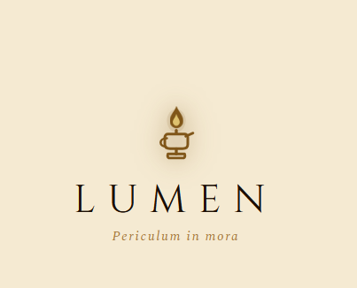
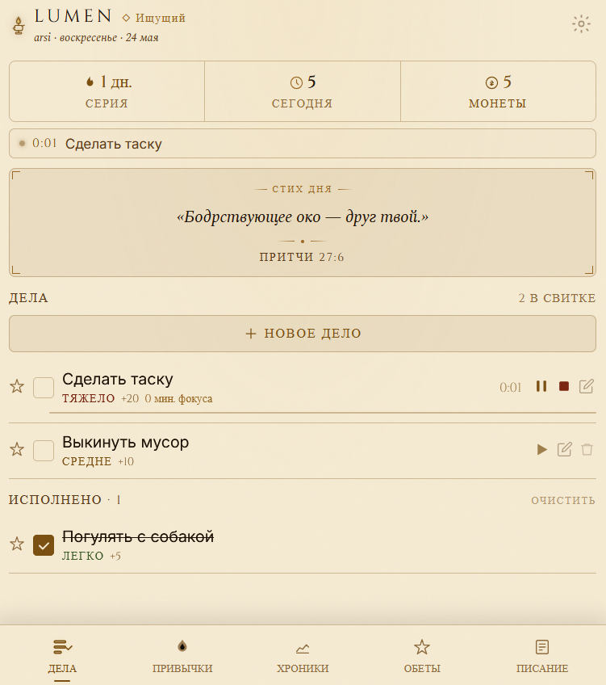
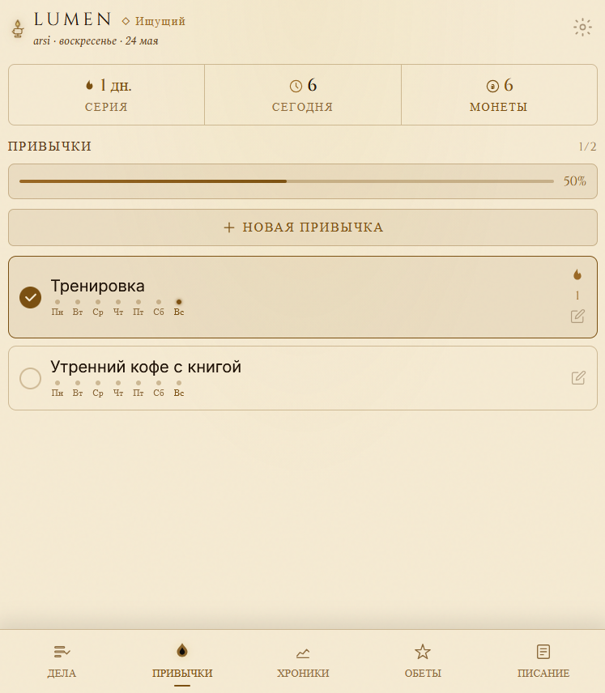
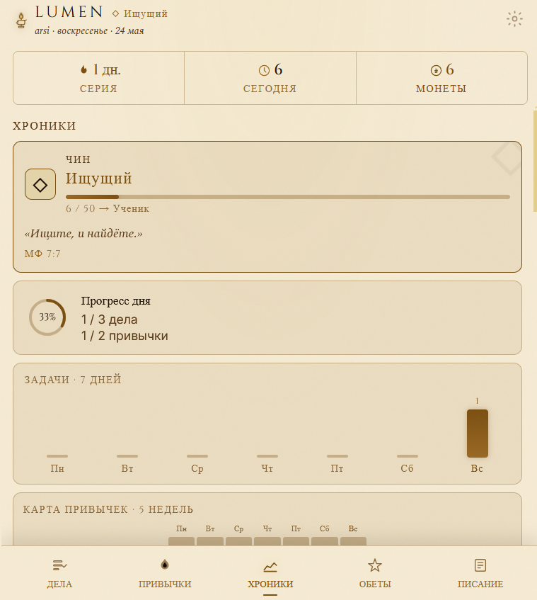
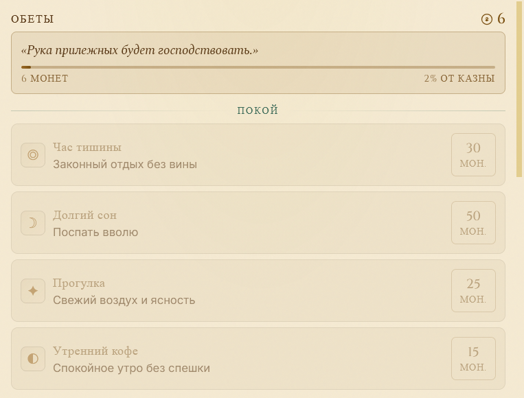
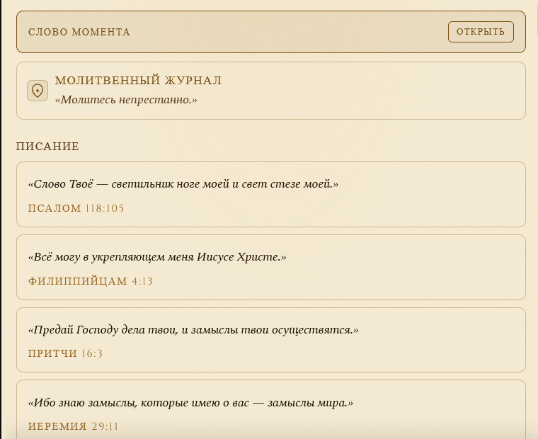

  

  <h1>Lumen</h1>

  
<em>трекер дел, привычек и духовной дисциплины</em>

  

    
    
  

  

    <a href="#english-version">English version</a>
  

---

## Кратко

Lumen — трекер дел, привычек и духовной дисциплины.

Никаких аккаунтов, серверов, рекламы. Все данные хранятся локально. Открой, отметь, прочти стих, двигайся дальше.

### Интерфейс

  <strong>Экран загрузки</strong> 
  

  <strong>Вкладка «Дела»</strong> 
  

  <strong>Вкладка «Привычки»</strong> 
  

  <strong>Вкладка «Хроники» (Статистика)</strong> 
  

  <strong>Вкладка «Обеты» (Награды)</strong> 
  

  <strong>Вкладка «Писание»</strong> 
  

## Скачать

Актуальные сборки в [Releases](https://github.com/vincere-mori/lumen/releases/latest).

Какой файл выбрать:

- Windows: `.exe` или `.msi`
- macOS: `.dmg`
- Linux: `.AppImage`, `.deb` или `.rpm`
- Android: `.apk`

Веб-версия: [vincere-mori.github.io/lumen](https://vincere-mori.github.io/lumen/)

## Что внутри

- Дела — приоритет, сложность, фокус-таймер с Помодоро
- Привычки — серии, тепловая карта по неделям
- Хроники — монеты, достижения, минуты фокуса
- Обеты — монеты в обмен на отдых, радость, милостыню, Субботу
- Писание — стих дня, Lectio Divina, молитвенный журнал
- Воскресный обзор — раз в неделю, взгляд назад
- Темы — тёмные палитры по времени суток

---

## English version

Lumen is a habit and task tracker built around faith, discipline, and daily scripture.

No accounts, no ads, no syncing. Everything stays on your device.

### Interface

  <strong>Loading Screen</strong> 
  

  <strong>Tasks Tab</strong> 
  

  <strong>Habits Tab</strong> 
  

  <strong>Stats/Chronicle Tab</strong> 
  

  <strong>Rewards/Vows Tab</strong> 
  

  <strong>Scripture Tab</strong> 
  

## Downloads

Latest release — [Releases](https://github.com/vincere-mori/lumen/releases/latest):

- Windows: `.exe` or `.msi`
- macOS: `.dmg` (universal)
- Linux: `.AppImage`, `.deb`, `.rpm`
- Android: `.apk`

Web version: [vincere-mori.github.io/lumen](https://vincere-mori.github.io/lumen/)

## Features

- Tasks with difficulty and priority, focus timer with Pomodoro
- Habits with streaks and a 5-week heatmap
- Chronicle: coins, achievements, focus minutes
- Rewards: spend coins on rest, joy, almsgiving, a Sabbath day
- Scripture: verse of the day, Lectio Divina, prayer journal
- Sunday Review: once a week, look back
- Themes: time-of-day palettes, Snow Skete, Byzantine Cinnabar, Olive Vigil

Dark aesthetic. Cinzel & Spectral. Quiet by design.

---

## Author

Made by [vincere-mori](https://github.com/vincere-mori).

Support the project:

  
  

